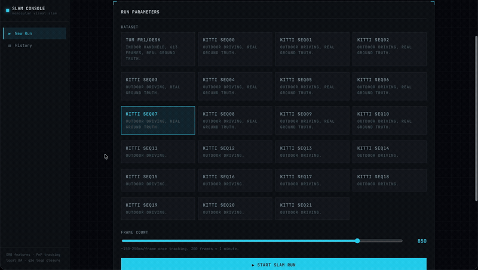

# Monocular Visual SLAM

A from-scratch monocular visual SLAM pipeline (ORB features → essential-matrix
initialization → PnP tracking → continuous local mapping → sparse bundle
adjustment → g2o pose-graph loop closure) with a real web dashboard for
running it against actual datasets and inspecting the result.

<p>
  
  
</p>

---
## Demo
Select the dataset, and then click on start SLAM run



Complete output showing trajectory and sparse map.


---

## Pipeline

```text
video frames
    |
    v
ORB feature extraction (grid-balanced, CLAHE)
    |
    v
Hamming matching + Lowe ratio + cross-check
    |
    v
Essential matrix + RANSAC  ->  two-view initialization
    |
    v
PnP tracking against the local map (recent keyframes' landmarks)
    |
    v
Keyframe insertion  ->  CONTINUOUS triangulation of new landmarks
    |
    v
Sparse local bundle adjustment (SciPy, sparse Jacobian)
    |
    v
Loop detection  ->  g2o pose-graph optimization on confirmed loops
    |
    v
sparse point cloud + camera trajectory + real ATE/RPE vs ground truth
```
---

## Quickstart

```bash
python3 -m venv .venv

source .venv/bin/activate

python3 app.py
```

Open **http://127.0.0.1:5100**. The first run seeds one real (not
synthetic) 80-frame run against whichever dataset is available, so you can
explore the dashboard immediately — click **"View Sample Run Instead"**.

---
## Getting datasets

### TUM fr1/desk (recommended first — ~600MB, has ground truth)

```bash
python3 download_data.py --dataset tum
```

### KITTI odometry (large — the full grayscale archive is ~23GB; ground truth poses are a separate ~1.3MB download)

```bash
python3 download_data.py --dataset kitti
```

Both datasets, once downloaded, are auto-detected by the app (`data/tum/rgbd_dataset_freiburg1_desk/`, `data/kitti/dataset/sequences/<NN>/`) — no configuration needed. The setup page only shows sequences it actually finds calibration + images for.

---

## Running tests

```bash
source .venv/bin/activate
python -m pytest tests/ -q
```
94 tests, fully offline (synthetic geometry + tiny generated dataset fixtures — no real TUM/KITTI download needed to run the suite), in under 2 seconds. `.venv/bin/pytest`'s own shebang references a stale path from before this project was moved on disk; `python -m pytest` sidesteps that rather than needing the venv recreated.

---

## Results

Run with `scripts/seed_demo_data.py` / the dashboard against the actual datasets:

| Dataset | Frames | ATE RMSE | RPE RMSE | Notes |
|---|---:|---:|---:|---|
| TUM fr1/desk | 80 | **0.119 m** | 0.012 m | Indoor, real ground truth, no loop closure triggered in this short a run |
| KITTI seq00 | 200 | **36.2 m** | 1.82 m | Outdoor driving, real ground truth, monocular scale drift with no loop closure opportunity this early in the sequence |

That KITTI number looks bad next to TUM's — and it should, honestly: 200 frames of real highway/city driving covers real distance, this is monocular VO with no stereo/IMU/GPS and no loop closure correction this early in the sequence, and drift compounds every frame. That gap between "indoor, ground truth every few centimeters" and "outdoor, tens of meters of drift" is itself the honest story monocular SLAM's own limitations tell — not a bug to paper over. 

---


## Known limitations

- Monocular scale is arbitrary until aligned to ground truth (Umeyama) or another sensor — expected, not a bug.
- The loop-closure pose-graph correction only adjusts keyframe poses and re-anchors landmarks to their first-observing keyframe; it does not retroactively correct the per-frame `trajectory` samples already recorded for non-keyframe frames (`map.py`'s trajectory list has no frame-id association to do that against without a larger restructuring).
- The loop-closure translation constraint is rescaled by the trajectory's own current estimate of inter-keyframe distance, since essential-matrix recovery has no metric scale — a practical approximation, not true joint scale estimation.
- The loop detector is a lightweight descriptor-matching fallback, not a real bag-of-words vocabulary (DBoW3) — fine at the scale this project runs at, would not scale to a long real deployment.
- Full joint pose+landmark bundle adjustment through g2o remains unintegrated (see bundle_adjuster.py's docstring) — local BA uses SciPy with a real sparse Jacobian instead.
- The KITTI 36m ATE at 200 frames is expected for uncorrected monocular VO over real driving distance, not a defect — see "Results" above.


